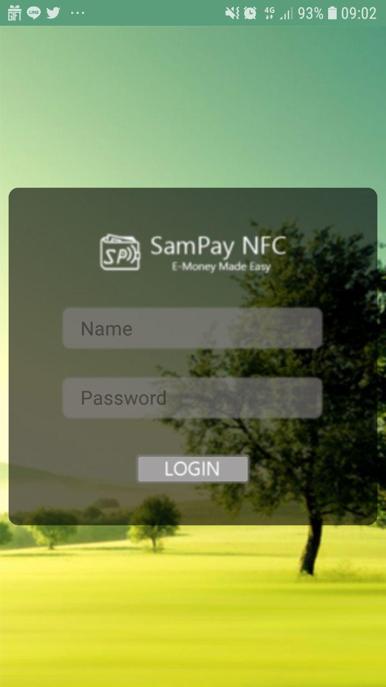
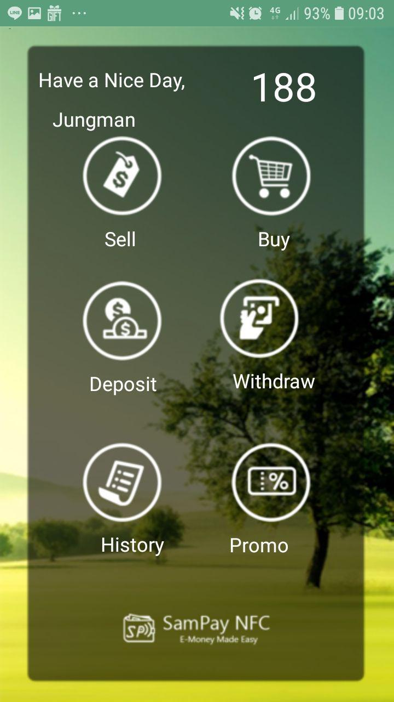
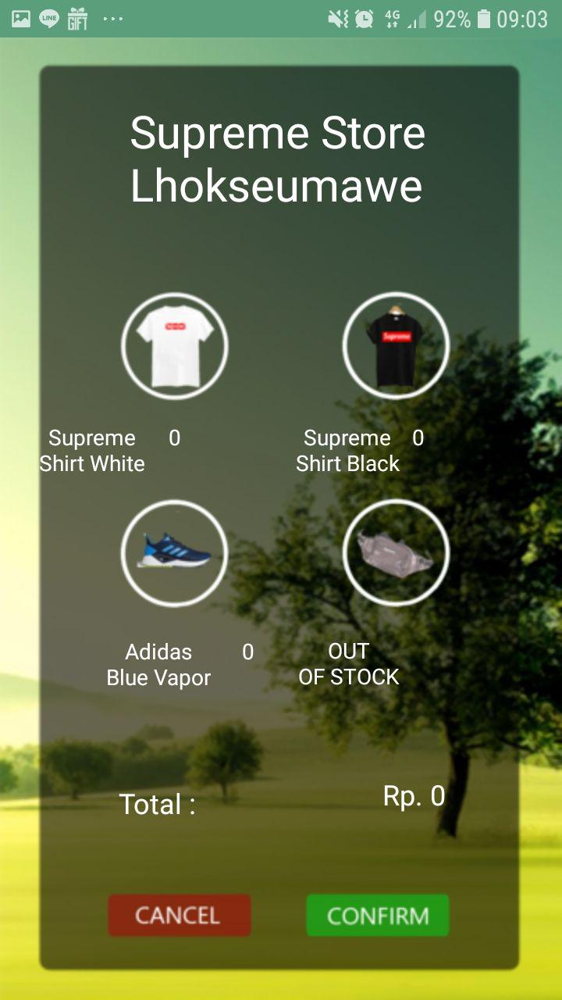

# SamPay - E-Money Made Simple

<p align="center">

</p>

Melakukan transaksi e-money jauh lebih praktis di Android dengan SamPay, terintegrasi dengan akun Google. 

Berikut merupakan hasil tampilan aplikasi :

<p align="center">



</p>

Proyek ini dikembangkan menggunakan Android Studio dan 100% Open Source. Segala ketentuan lisensi diatur oleh GNU GPL. Aplikasi ini dikhususkan untuk riset Fintech dan O2O. Dilarang menggunakan aplikasi ini untuk kepentingan komersial.

Repository Dedicated for Mobile Apps Course (ET4044)
- M. Hilmi (18115006)
- Jungman Berliansyah (18115033)

### Logbook :

```
11/11/2018
* Menambahkan activity withdraw & list
* NFC

21/10/2018
Menambahkan activity deposit

10/10/2018
Sdh ditambahkan beberapa activity, navigasi, & fungsi login dummy sudah berhasil

04/10/2018
Pembuatan asset yang dapat digunakan untuk layout front end aplikasi

01/10/2018
Perancangan mock up dari aplikasi SamPay dilaksanakan di ruang Compnet

26/09/2018
Akhirnya ide fix yang diambil adalah SamPay, sebuah platform emoney yang memanfaatkan NFC pada HP.

10/09/2018
Penjajakan ide aplikasi sebagai berikut :
- Remote 3D Printer Controller
- Fingerprint Home Lock
- Simple Chatting App

18/09/2018
- Gojek x Grab Comparator
- Mesin Absen NFC-```
